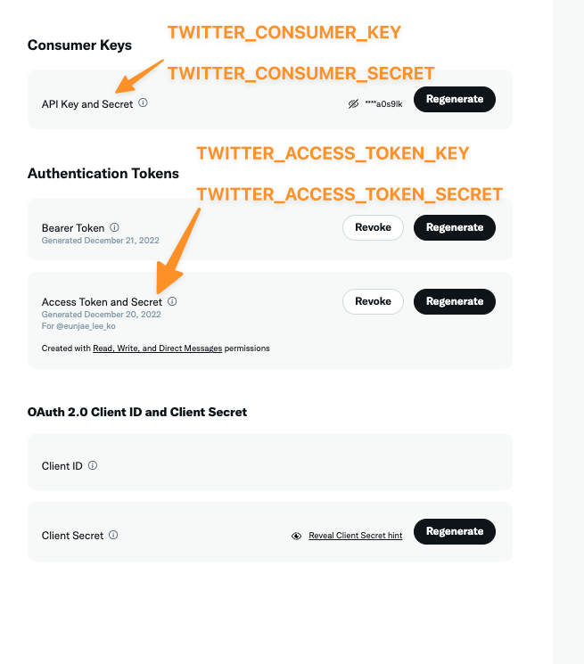
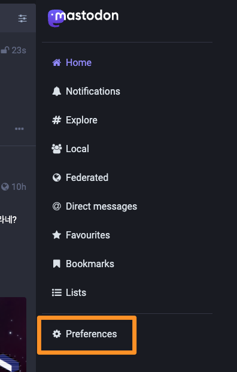
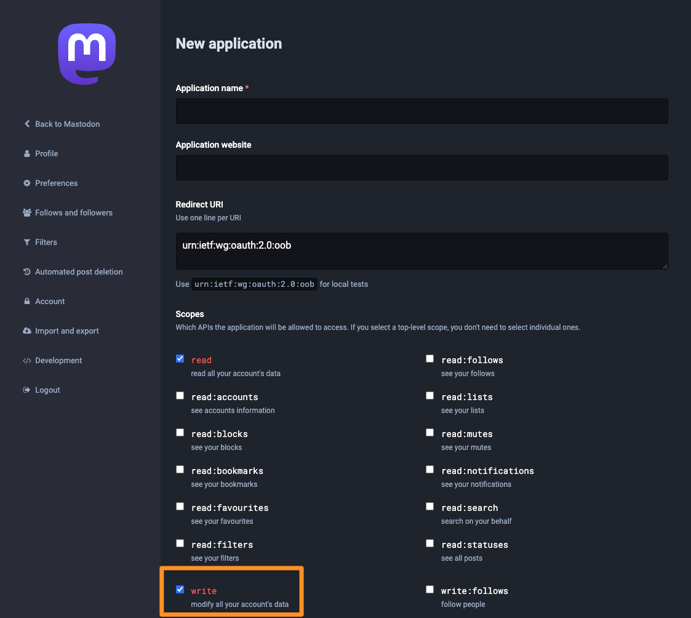
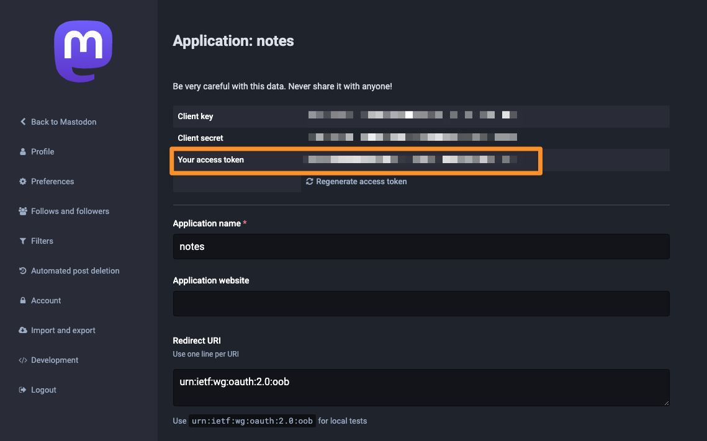
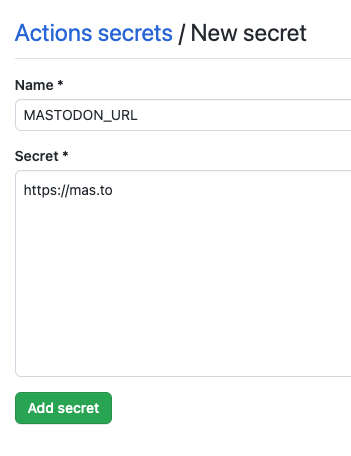

# notes

This is a repository to cross-post texts across Twitter and Mastodon. If you create an issue and give `publish` label to it, GitHub Workflows automatically cross-posts it.

## Setup

1. Fork this repository

2. Get Twitter tokens

1. Go to https://developer.twitter.com/portal/dashboard

2. Click the app to see the tokens

3. Grab them all

You need

- `TWITTER_CONSUMER_KEY`
- `TWITTER_CONSUMER_SECRET`
- `TWITTER_ACCESS_TOKEN_KEY`
- `TWITTER_ACCESS_TOKEN_SECRET`

3. Setup the Twitter tokens in your repository

1. Go to your repository and follow this path

2. Click "New repository secret" button and add the keys above. You need to add secret one-by-one.

4. Get Mastodon token

1. Go to your Mastodon server and follow this path to create a new application

2. Name the application and the rest is optional. (`write` permission is what we need and it's checked by default)

3. After creating it, open the app again, and you'll get the access token.

5. Setup the Mastodon token in your repository

1. Go to your repository and follow this path

2. Click "New repository secret" button and add the access token (name: `MASTODON_ACCESS_TOKEN`)

3. Click "New repository secret" button again, and this time, add your Mastodon server url

6. Create an issue to cross-post

1. Go to your Issues tab on your repository

2. Create an issue with a label `publish`. Or, you can create an issue first, and later add a label `publish` when you're ready to publish it.

3. voilà! It's done.

## Reference

- twitter-api-v2: https://github.com/plhery/node-twitter-api-v2
- twitter-text: https://github.com/twitter/twitter-text
- masto.js: https://github.com/neet/masto.js/
- Structuing and bundling for GitHub workflows: https://github.com/amannn/action-semantic-pull-request
